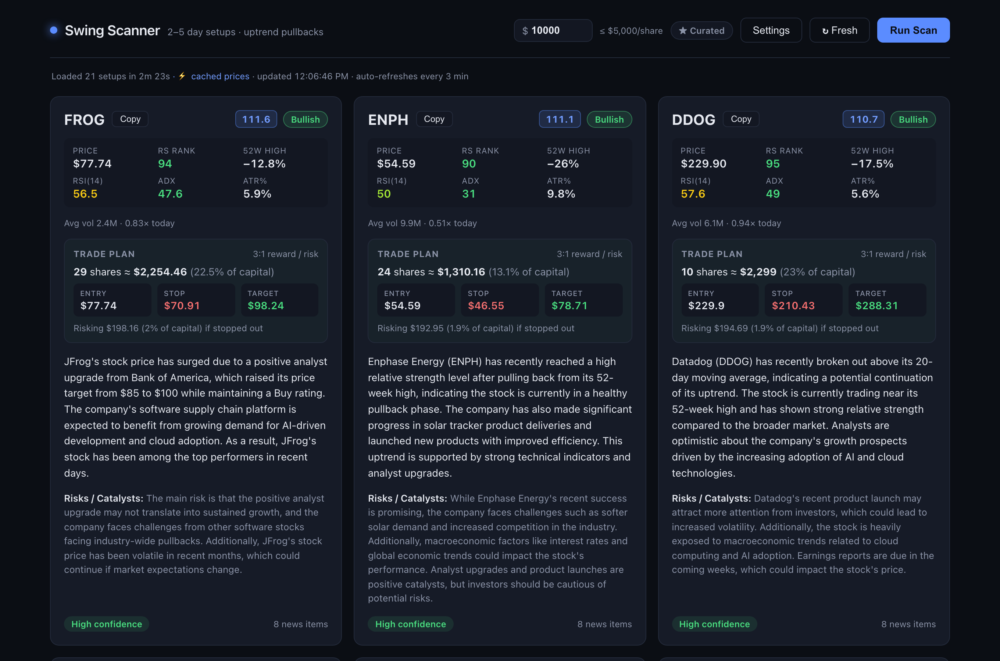
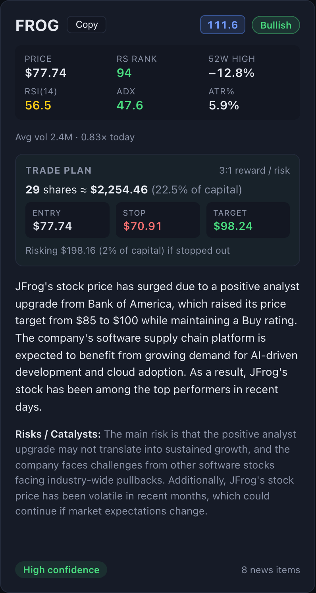
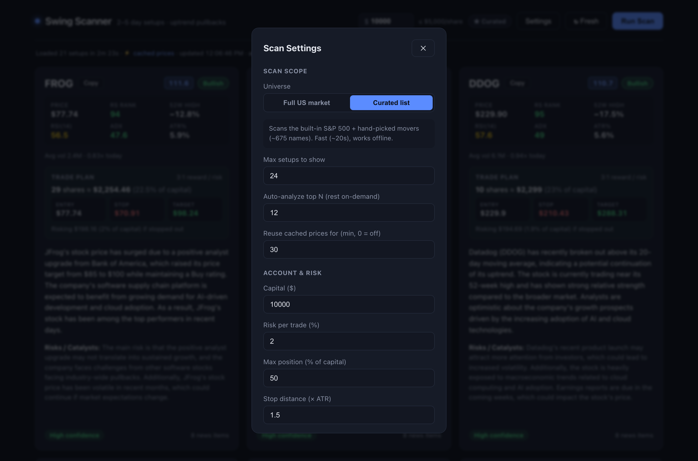

# Swing Scanner

A native macOS desktop app that scans the **entire US stock market** for high-probability 2–5 day swing-trade setups, sizes each one to your account with professional risk management, and adds an AI read on the news — all running **100% locally and free** (no API keys, no accounts, no data leaving your machine).

It implements a real, research-backed strategy — the **"leader pullback"** used by elite momentum traders — not a generic moving-average screen.



> **Stack:** Python · FastAPI · React · Electron · pandas · yfinance · Ollama (local LLM). Everything runs on `localhost`.

---

## Highlights

- 🎯 **Research-backed strategy** — Minervini's Trend Template + Qullamaggie's momentum method (relative-strength ranking, 52-week-high proximity, full MA stack, ADX/ATR/RSI bands). [See the criteria →](#the-strategy-leader-pullback)
- 🌎 **Whole-market scan** — pulls every US common stock (~5,900 names) live, so it finds the small/mid-cap movers curated lists miss. Relative strength is ranked across the full universe.
- 💰 **Account-aware position sizing** — every result comes pre-sized with the 1–2% risk rule and an ATR-based stop: exact shares, entry/stop/target, and dollars at risk.
- 🧠 **Local AI analysis** — each setup gets a plain-English summary, sentiment, and risk/catalyst read from a local LLM. Free, private, streams in per-card.
- ⚡ **Instant rescans** — a smart price cache re-screens the whole market in ~1 second when you tweak a filter, while *never* caching which stocks passed (so it can't miss anything).
- 🖥️ **Real native app** — exports to a signed `.app` with a custom icon, launches the backend and AI server automatically, lives in your Dock.

---

## The strategy: "leader pullback"

This implements the setup that elite swing traders actually use — **buy a short-term pullback in a market-leading uptrend** — drawn from [Mark Minervini's Trend Template](https://deepvue.com/screener/minervini-trend-template/) and [Kristjan "Qullamaggie" Kullamägi's](https://qullamaggie.net/) momentum method. The shared core idea: *only trade the strongest stocks, and only when they take a healthy breather.*

A stock passes when **all** of these hold (daily bars, 2 years of history):

| Group | Criterion | Default | Rationale |
|---|---|---|---|
| **Leadership** | Relative-strength rank (vs scanned universe) | ≥ 70 / 100 | Minervini RS ≥ 70; trade top-RS names |
| | Within X% of the 52-week high | ≤ 30% | leaders stay near their highs |
| | At least X% above the 52-week low | ≥ 25% | well off the lows |
| **Trend** | Price above 50 **and** 200 SMA | — | confirmed long-term uptrend |
| | 20 SMA > 50 SMA > 200 SMA (full stack) | — | Minervini MA alignment |
| | 200 SMA rising | — | the long-term trend is up |
| | ADX(14) | ≥ 25 | a genuinely trending stock, not chop |
| **Pullback** | RSI(14) | 40–60 | the documented "healthy pullback" band |
| **Volatility** | ATR% (daily range) | ≥ 2.0% | enough movement to profit in 2–5 days |
| **Liquidity** | 21-day avg volume | ≥ 500,000 | tradeable |
| | Share price | $15 – capital×max-position-% | no penny stocks; affordable for the account |

**Relative-strength rank** is computed IBD-style: each stock's blended 1/3/6-month return is ranked across the entire scanned universe into a 0–100 percentile. Results are ordered by a **setup score** weighting relative strength most heavily, then trend strength, pullback depth, and volatility — matching the research consensus that *leadership matters most*. Every threshold is adjustable in Settings.



---

## Risk management & position sizing

Every match is pre-sized to your account using the **1–2% rule with an ATR-based stop** — the standard professional approach:

- **Capital** drives everything; the price ceiling becomes capital × max-position-%, so you're never shown a stock you can't sensibly buy.
- **Stop** = entry − (1.5 × ATR), placed beyond normal daily noise.
- **Shares** = the most you can buy while risking ≤ your risk-% of capital (default 2%) if stopped out, capped by affordability.
- **Target** = a configurable reward-to-risk level (default 3:1).
- Each card shows exact shares, position cost, entry/stop/target, and dollars at risk. Setups too volatile to size safely for the account get a **⚠ high-risk** flag instead of being silently hidden.

---

## AI analysis (free, local)

Each passing stock's recent headlines are fed to a local LLM, which returns a 2–3 sentence summary, a **Bullish / Neutral / Bearish** sentiment, notable **risks & catalysts**, and a **High / Medium / Low** confidence based on technical + sentiment alignment.

By default this runs on a **free local model via [Ollama](https://ollama.com)** — nothing leaves your machine and it costs nothing. The provider is swappable (`AI_PROVIDER` in `.env`): a hosted model (e.g. Anthropic's Claude) gives sharper analysis if you'd rather. News is prefetched concurrently and analyses run in parallel; only the top-N setups are analyzed automatically and the rest are one click away, so it stays responsive.



---

## Performance features

- **Whole-market or curated universe**, switchable in Settings. The full market (~5,900 stocks) is fetched live from the public NASDAQ symbol directory (ETFs, warrants, and test issues filtered out) and cached for 7 days.
- **Smart price cache** — a full-market download is the slow part (~3 min). The scanner caches raw price bars and reuses them within a short window, so rescans (and filter tweaks) finish in **~1 second**. Crucially, the cache stores only the *data*, never which stocks passed — *every* rescan re-evaluates the whole universe, so it can never cause a missed setup. A **↻ Fresh** button forces a full re-pull anytime.
- **Streaming results** — technical cards appear the moment the scan finishes; AI fills in per-card afterward, with a live elapsed timer.
- **Auto-refresh** — loaded setups re-pull live prices and re-size every few minutes (no full re-scan).

---

## Setup

Prereqs: macOS, Python 3.10+, Node 18+.

```bash
./start.sh
```

That's it — no API keys, no accounts. `start.sh` creates the Python virtualenv, installs dependencies, sets up the free local AI, builds the frontend, and launches the desktop app (which spawns the backend automatically).

### Export as a Dock app

```bash
./build-app.sh
```

Builds **Swing Scanner.app**, installs it to `/Applications` (ad-hoc signed — no paid Apple Developer account needed), and reveals it in Finder. Double-clicking starts the backend and local AI and opens the window — no Terminal required.

### Run the pieces manually

```bash
# Backend (FastAPI on :8765)
cd backend && .venv/bin/uvicorn app.main:app --port 8765

# Frontend dev server (Vite hot reload on :5173)
cd frontend && npm run dev
```

---

## How it works

```
┌── Electron (native shell) ───────────────────────────────┐
│  • spawns the backend + local AI on launch               │
│  • loads the React UI                                     │
└──────────────────────────────────────────────────────────┘
            │ HTTP (localhost:8765)
┌── FastAPI backend ───────────────────────────────────────┐
│  scanner.py   download + indicators + filter + RS rank   │
│  risk.py      ATR-stop position sizing (1–2% rule)       │
│  ai.py        local-LLM news analysis (provider-agnostic)│
│  price_cache  on-disk bar cache for instant rescans      │
└──────────────────────────────────────────────────────────┘
            │
   yfinance (market data) · Ollama (local LLM)
```

The React frontend is a dark, single-page dashboard; the FastAPI backend does the heavy lifting; Electron packages it into a native macOS app. All market data comes from the free, unofficial yfinance feed.

---

## Notes

- yfinance is unofficial and occasionally rate-limited; if a scan errors mid-download, just rerun it (the cache makes the retry fast).
- Local AI analysis takes roughly 5–15 s per stock on Apple Silicon; only the top setups are analyzed automatically to keep things snappy.
- **This is a research and education tool, not financial advice.** It surfaces and analyzes setups — it does not place trades. Do your own due diligence.

---

## Methodology sources

The scan criteria are grounded in established swing-trading research:

- [Mark Minervini's Trend Template](https://deepvue.com/screener/minervini-trend-template/) — MA stack, 52-week-high proximity, relative strength
- [Qullamaggie's momentum method](https://qullamaggie.net/) — trading top relative-strength leaders and high-ADR movers
- [Scanz — swing-trading scans](https://scanz.com/swing-trading-scans/) — ADX for trend strength
- [ChartMill — technical swing screener](https://www.chartmill.com/getting-started/technical-stock-screener) — RSI 40–60 healthy-pullback band, volume/ATR filters
